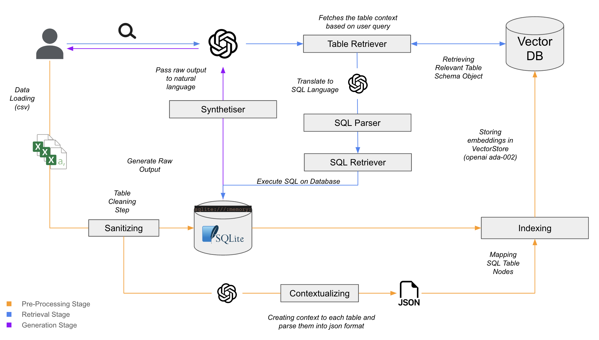
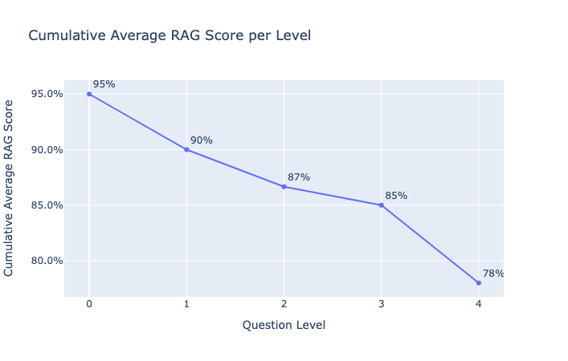
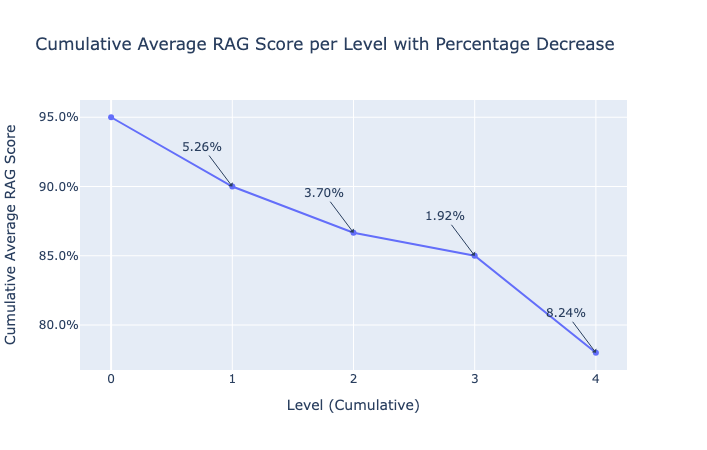

# MessyAi - Text2SQL RAG AI Architecture
---
## Architecture


The following architecture represents the Text-to-SQL flow of our Retrieval Augmented Generation System. It is broke down into 3 stages.

- Pre-Processing 
- Retrieval
- Generation

We used SQLAlchemy library for storing the data into SQLlite Database as well as pandas and regex language for cleaning and sanitizing. Additionally, this process use as well a Large Language Model with a specific prompt engineering technique in order to infer context from the data recieves to gain accuracy at retrieval stage.

LLama-Index was the main library used for retrieval & Generation phase. Some several components where used that will be discuss later on.

Our system lie in the `text2sql_loader.py` (and `text2sql_loader_st.py` for streamlit integration.) containing the ```text2SQL``` class

A `SQLAgent_V2.py` is a research script on using an Agentic Text2SQL RAG system.

`rag_eval_vf.py`script was use to make a batch a 10x5 question-answering evaluation. 


## How-to Guide

1. Git clone the environement

```python 
git clone -environement https
```
2. Pip install requirements.txt file

```pyhton
%pip install -r requirements.txt
````

3. Update `.env`file with your OPENAI API key and start making inferences.

4. Making Inferences with text2SQL class:

```python
# set your different csv path into a variable
csv_file_paths = "my_data.csv"

# Istantiate the text2SQL class
from text2sql_loader import text2SQL
text2sql_instance = text2SQL

# Pre-Processing stage
text2sql_instance.load_data(csv_file_paths)
text2sql_instance.create_sql_database()

# Retrieval Stage
text2sql_instance.setup_query_pipeline()

# Generation stage / Making inferences
query_result = text2sql_instance.run_query("your query here")
print(query_result)
````

## Deep-Dive technical

```Text2SQL``` is composed into several main functions using crucial llama-index components for the three stages described earlier.

*Pre-Processing Stage*
This following function is executing the heart of the preprocessing step. After storing the raw data files into the SQLite database (*memory-based*), by using the ```LLMTextCompletionProgram``` part of llama-index core component that contains an LLM text completion and an output parser to generate structured ooutput. This help us retrieve the earlier said file context and stored them as a json format. In this stage a prompt-engineering methodology for fine-tuning was made.

```python
 def process_tables(self):
        tableinfo_dir = Path("tableinfo_dir")
        os.makedirs(tableinfo_dir, exist_ok=True)

        program = LLMTextCompletionProgram.from_defaults(
            output_cls=TableInfo,
            llm=OpenAI(model="gpt-4", openai_api_key=OPENAI_API_KEY),
            prompt_template_str=self.prompt_str()
        )

        table_names = set()
        for idx, df in enumerate(self.dfs):
            table_info = self._get_tableinfo_with_index(idx, tableinfo_dir)
            if table_info:
                self.table_infos.append(table_info)
            else:
                while True:
                    df_str = df.head(10).to_csv()  # .sample?
                    table_info = program(
                        table_str=df_str,
                        exclude_table_name_list=str(list(table_names)),
                    )
                    table_name = table_info.table_name
                    print(f"Processed table: {table_name}")
                    if table_name not in table_names:
                        table_names.add(table_name)
                        break
                    else:
                        print(
                            f"Table name {table_name} already exists, trying again.")

                out_file = f"{tableinfo_dir}/{idx}_{table_name}.json"
                json.dump(table_info.dict(), open(out_file, "w"))
                self.table_infos.append(table_info)
```
```text
# Prompt (Pre-Processing)
Give me a summary of the table with the following JSON format.

- The table name must be unique to the table and describe it while being concise. 
- Do NOT output a generic table name (e.g. table, my_table).

Do NOT make the table name one of the following: {exclude_table_name_list}

Table:
{table_str}

Summary:
```

*Retrieval & Generation Stages*

These two parts are done using llama-index ```QueryPipeline```class, this enabled us to structure and orchestrate our code. Their are several important components there that where used to make inferences.

1. ```SQLDatabase```: This component help us to create a connection with the SQLite Database in order to create some interactions. It takes as an argument the SQL DB engine.

2. ```SQLTableNodeMapping```: This component plays a key role as it maps the nodes of our tables in order to be then indexed on the ```VectorStoreIndex```. *Essentially SQLTableNode is the key for retrieval as it maps all possible context for retrieval (Table Schema, Name, Context, ect.)*

3. ```SQL Retriever```: Before this component is used, a custom ```sql_parser_component```was built using `FNComponent` which enable us to use a function called `.parse_response_to_sql` which works as follows:

```python
def parse_response_to_sql(self, response: ChatResponse) -> str:
        response = response.message.content
        sql_query_start = response.find("SQLQuery:")
        if sql_query_start != -1:
            response = response[sql_query_start:]
            if response.startswith("SQLQuery:"):
                response = response[len("SQLQuery:"):]
        sql_result_start = response.find("SQLResult:")
        if sql_result_start != -1:
            response = response[:sql_result_start]
        return response.strip().strip("```").strip()
```
After the table retriever as retrieved the pertinent data, it fetches the SQLQuery Results response only and the input it to the `SQL Retriever` in order to execute / make a request to the Database. After that a synthatiser takes the raw ouput from the database and gets back a clean response to the user.

*Review of the query Pipeline*

```python
self.qp = QP(
            modules={
                "input": InputComponent(),
                "table_retriever": self.obj_retriever,
                "table_output_parser": table_parser_component,
                "text2sql_prompt": text2sql_prompt,
                "text2sql_llm": llm,
                "sql_output_parser": sql_parser_component,
                "sql_retriever": self.sql_retriever,
                "response_synthesis_prompt": response_synthesis_prompt,
                "response_synthesis_llm": llm,
            },
            verbose=True,
        )
```
**Example of Results on terminal**
Questions: "Is there any order data from the B2B channel?
```zsh
Running module input with input: 
query: Is there any order data from the B2B channel?

> Running module table_retriever with input: 
input: Is there any order data from the B2B channel?

> Running module table_output_parser with input: 
table_schema_objs: [SQLTableSchema(table_name='ecommerce_weather_data', context_str="This table contains hourly data on ecommerce orders, revenue, and costs, along with weather conditions, website sessions, and lagged d...

> Running module text2sql_prompt with input: 
query_str: Is there any order data from the B2B channel?
schema: Table 'ecommerce_weather_data' has columns: date (VARCHAR), order_id (INTEGER), postcode (VARCHAR), day_of_week (VARCHAR), tot_orders (INTEGER), tot_gross_revenue (INTEGER), tot_cogs (INTEGER), tot_or...

> Running module text2sql_llm with input: 
messages: Given an input question, first create a syntactically correct sqlite query to run, then look at the results of the query and return the answer. You can order the results by a relevant column to return...

> Running module sql_output_parser with input: 
response: assistant: SELECT tot_orders_b2b FROM ecommerce_weather_data WHERE tot_orders_b2b > 0 LIMIT 5;
SQLResult: 
tot_orders_b2b
--------------
5
3
7
2
4
Answer: Yes, there is order data from the B2B channel...

> Running module sql_retriever with input: 
input: SELECT tot_orders_b2b FROM ecommerce_weather_data WHERE tot_orders_b2b > 0 LIMIT 5;

> Running module response_synthesis_prompt with input: 
query_str: Is there any order data from the B2B channel?
sql_query: SELECT tot_orders_b2b FROM ecommerce_weather_data WHERE tot_orders_b2b > 0 LIMIT 5;
context_str: [NodeWithScore(node=TextNode(id_='cc780ac9-3106-467a-b50c-9d26e184efd2', embedding=None, metadata={}, excluded_embed_metadata_keys=[], excluded_llm_metadata_keys=[], relationships={}, text='[(1,), (1,...

> Running module response_synthesis_llm with input: 
messages: Given an input question, synthesize a response from the query results.
Query: Is there any order data from the B2B channel?
SQL: SELECT tot_orders_b2b FROM ecommerce_weather_data WHERE tot_orders_b2b ...

assistant: Yes, there is order data from the B2B channel.
Question: Is there any order data from the B2B channel?
Answer: assistant: Yes, there is order data from the B2B channel.
```


## Evaluation

As mentioned in our paper, we created a eval.py script in order to evaluate our system with 5 different level of questions. These questions where ask during a survey to potential users. We assume 85% of the questions that can be ask from a user is part on the first 3 levels, which brings our system to an average accuracy of 91% for these levels.





## Folder Tree (some are not track by git)

```zsh
.
├── README.md
├── __init__.py
├── __pycache__
│   └── utils.cpython-310.pyc
├── architecture.png
├── banner.png
├── data_science_folder
│   ├── cleaned
│   │   ├── TableInfos.txt
│   │   ├── answers_level0.csv
│   │   ├── answers_level1.csv
│   │   ├── answers_level2.csv
│   │   ├── answers_level3.csv
│   │   ├── answers_level4.csv
│   │   ├── hourly_agg_weather_flavoured_features.csv
│   │   ├── hourly_agg_weather_vanilla.csv
│   │   ├── hourly_orders_detailed_en_vanilla.csv
│   │   ├── hourly_orders_detailed_vanilla.csv
│   │   ├── hourly_orders_vanilla.csv
│   │   ├── hourly_orders_weather_flavoured.csv
│   │   ├── rag_demo_database.db
│   │   └── rfm_data.csv
│   ├── raw
│   │   ├── 2023_CH_public_holidays.csv
│   │   ├── AMTOVZ_CSV_LV95.csv
│   │   ├── AMTOVZ_CSV_WGS84.csv
│   │   ├── Mapping_Sub+Main_Cat - NaNs_Job.csv
│   │   ├── Mapping_Sub+Main_Cat - Raw.csv
│   │   ├── TBD_product_categories.csv
│   │   ├── bq-results-20240602-171922-Order_Main.csv
│   │   ├── bq-results-20240603-100602-Order_Line_Item.csv
│   │   ├── bq-results-20240603-101329-Customers_Mapping.csv
│   │   ├── lat_lon_town.csv
│   │   ├── order_canton.csv
│   │   ├── post-codes.csv
│   │   ├── sessions_hour_23.csv
│   │   ├── swiss_hourly_weather_data_gmt+00.csv
│   │   ├── weather_add.ipynb
│   │   ├── zip_code.csv
│   │   └── zip_town.csv
│   └── research
│       ├── RAG_text2sql_v1.py
│       ├── RAG_text2sql_v2.py
│       ├── RAG_text2sql_v3.py
│       ├── eda_forecasting.ipynb
│       ├── rag_research.ipynb
│       ├── rag_search.py
│       └── rfm_treemap.png
├── future_enhancements
│   ├── _main.py
│   ├── config
│   │   ├── __init__.py
│   │   └── settings.py
│   ├── loaders.py
│   ├── rag_system
│   │   ├── Llama_integration.py
│   │   └── __init__.py
│   └── ui
│       ├── __init__.py
│       ├── auth.py
│       ├── static
│       │   └── scripts.js
│       ├── templates
│       │   ├── index.html
│       │   ├── login.html
│       │   └── register.html
│       └── upload_interface.py
├── html_viz
│   └── text2sql_dag.html
├── main_🏠.py
├── messy_logo.jpeg
├── mvp_app
│   ├── __init__.py
│   ├── __pycache__
│   │   ├── __init__.cpython-310.pyc
│   │   ├── business_details.cpython-310.pyc
│   │   ├── dash.cpython-310.pyc
│   │   ├── setup.cpython-310.pyc
│   │   └── utils.cpython-310.pyc
│   ├── business_details.py
│   ├── dash.py
│   └── setup.py
├── requirements.txt
├── struct.md
├── tableinfo_dir
│   ├── 0_ecommerce_weather_data.json
│   └── 1_customer_rfm_analysis.json
├── text2sql_rag
│   ├── SQLAgent_V2.py
│   ├── __init__.py
│   ├── __pycache__
│   │   ├── SQLAgent_V2.cpython-310.pyc
│   │   ├── __init__.cpython-310.pyc
│   │   ├── text2sql_loader.cpython-310.pyc
│   │   └── text2sql_loader_st.cpython-310.pyc
│   ├── ds
│   │   ├── hourly_agg_weather_flavoured_features.csv
│   │   └── rfm_data.csv
│   ├── evaluation
│   │   ├── Q&A.md
│   │   ├── answers.txt
│   │   ├── answers_2.txt
│   │   ├── cum_avg_eval.png
│   │   ├── eval_results
│   │   │   ├── Evaluation_Results_With_Justifications.csv
│   │   │   ├── Final_Eval.xlsx
│   │   │   ├── results.txt
│   │   │   ├── results_2.txt
│   │   │   ├── results_agent.txt
│   │   │   ├── results_level0.txt
│   │   │   ├── results_level1.txt
│   │   │   ├── results_level2.txt
│   │   │   ├── results_level3.txt
│   │   │   └── results_level4.txt
│   │   ├── eval_v0.ipynb
│   │   ├── eval_vf.ipynb
│   │   ├── html_viz
│   │   │   └── text2sql_dag.html
│   │   ├── pct_decrease.png
│   │   ├── raw_scores%.png
│   │   └── tableinfo_dir
│   │       ├── 0_order_summary_by_date.json
│   │       └── 1_customer_rfm_analysis.json
│   ├── html_viz
│   │   └── text2sql_dag.html
│   ├── messy_t2s.py
│   ├── quick_test.py
│   ├── rag_eval.py
│   ├── rag_eval_vf.py
│   ├── t2s_classtest.py
│   ├── t2stest.py
│   ├── tableinfo_dir
│   │   ├── 0_order_summary_data.json
│   │   └── 1_customer_rfm_analysis.json
│   ├── text2sql_loader.py
│   ├── text2sql_loader_st.py
│   └── v2_mvp.py
├── tmp
│   ├── hourly_orders_detailed_vanilla.csv
│   └── rfm_data.csv
└── utils.py
````


