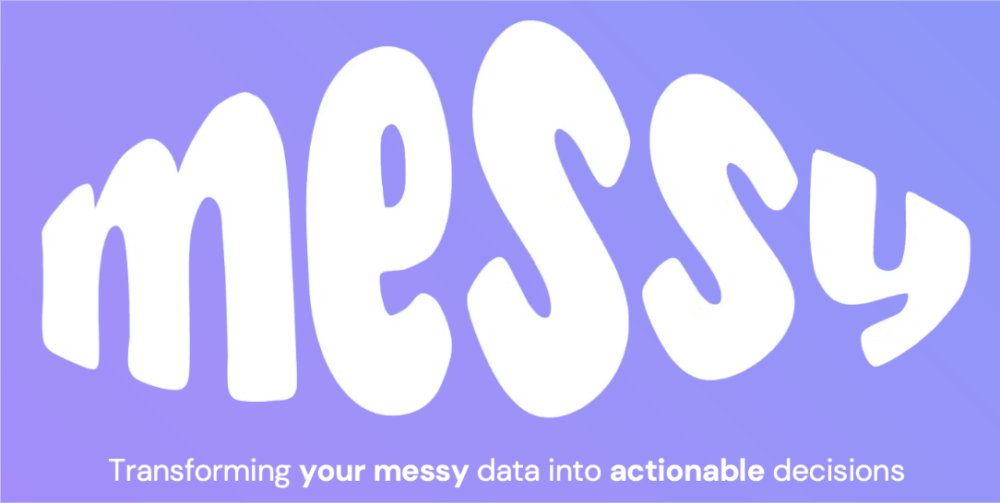

# MessyAi - MVP Development
---
```markdown
Validation / Development of the MVP
1. MVP (Where we are now)
    a) Explain current state of development
2. Methodology
    b) Explain MVP objective, data sources and systems being used
3. Data integration
4. Backend System
    a) Concepts and code structure
    b) Evaluation
5. Frontend App
6. Accomplishments/Limitations and Next Steps
````

## Introduction


